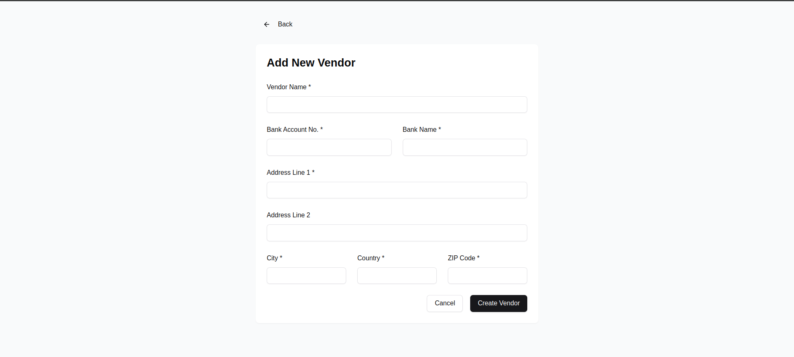

# VendorHub - Vendor Management System

A fullstack vendor management system built with Next.js 14, TypeScript, postgresql and Tailwind CSS.




## Features

- Secure authentication with Clerk
- User-specific vendor management
- CRUD operations for vendors
- Paginated vendor list
- Modern UI with shadcn/ui components

## Tech Stack

- **Framework:** Next.js 14 with App Router
- **Language:** TypeScript
- **Styling:** Tailwind CSS
- **UI Components:** shadcn/ui
- **Authentication:** Clerk
- **Database:** PostgreSQL
- **ORM:** Prisma
- **Icons:** Lucide React

## Getting Started

### Environment Variables

Create a `.env` file in the root directory with the following variables:

```env
DATABASE_URL="your_postgresql_database_url"
NEXT_PUBLIC_CLERK_PUBLISHABLE_KEY="your_clerk_publishable_key"
CLERK_SECRET_KEY="your_clerk_secret_key"
```

### Installation

1. Clone the repository:

```bash
git clone https://github.com/AnchalDevBytes/js-tiger-assignment.git
```

2. Install dependencies:

```bash
npm install
```

3. Set up the database:

```bash
npx prisma migrate dev --name init
npx prisma generate
```

4. Run the development server:

```bash
npm run dev
```

5. Open [http://localhost:3000](http://localhost:3000) in your browser.

6. **Deployment:**
   Deployed on vercel : [live](https://js-tiger-assignment-two.vercel.app/)
